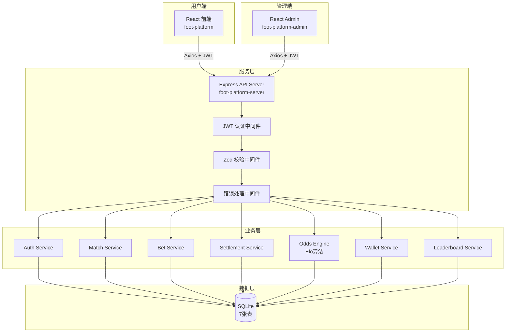
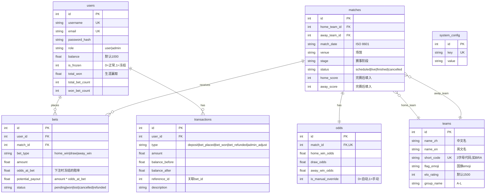

# 世界杯模拟足彩平台 — 项目计划书

> 版本：v1.0 | 日期：2026-06-01 | 项目类型：全栈Web应用

---

## 一、项目概述

### 1.1 项目目标

开发一个2026世界杯模拟足彩网站，为用户提供虚拟币下注体验。系统基于球队实力（Elo评级）自动计算赔率，用户可注册、充值（初始虚拟币）、浏览比赛、下注、查看战绩和排行榜。

### 1.2 项目路径

| 模块 | 路径 | 说明 |
|------|------|------|
| 用户前端 | `F:\opclab\foot-platform\foot-platform` | 面向用户的投注网站 |
| 管理后台 | `F:\opclab\foot-platform\foot-platform-admin` | 面向管理员的运营后台 |
| 后端服务 | `F:\opclab\foot-platform\foot-platform-server` | RESTful API服务 |
| 计划文档 | `F:\opclab\foot-platform\foot-platform\docx` | 项目文档存放目录 |

---

## 二、技术架构

### 2.1 技术栈选型

| 层次 | 技术 | 理由 |
|------|------|------|
| **用户前端** | React 18 + Vite + TypeScript + Tailwind CSS | 现代工具链，快速开发，HMR热更新 |
| **状态管理** | Zustand | 轻量级（~1KB），零样板代码 |
| **HTTP客户端** | Axios | 拦截器支持JWT自动附加和401全局处理 |
| **管理后台** | React 18 + Vite + TypeScript + Ant Design 5 | 中文组件库（Table/Form/Modal/Charts），大幅减少开发量 |
| **图表** | Recharts（用户端）+ @ant-design/charts（管理端） | SVG图表，按需加载 |
| **服务端** | Node.js 20 + Express 4 + TypeScript | 单语言全栈，中间件生态成熟 |
| **数据库** | better-sqlite3（SQLite） | 零配置部署，WAL模式支持并发读，单文件存储 |
| **认证** | JWT（jsonwebtoken + bcryptjs） | 无状态认证，前后端分离友好，7天有效期 |
| **校验** | Zod | 类型安全的请求体验证，与TypeScript深度集成 |

### 2.2 架构图



---

## 三、目录结构

```
F:/opclab/foot-platform/
│
├── foot-platform/                    # 用户前端
│   ├── public/
│   │   └── favicon.ico
│   ├── src/
│   │   ├── main.tsx                  # 入口文件
│   │   ├── App.tsx                   # 路由配置 + 全局Provider
│   │   ├── index.css                 # Tailwind指令 + 全局样式
│   │   ├── vite-env.d.ts
│   │   ├── api/
│   │   │   └── client.ts            # Axios实例 + JWT拦截器
│   │   ├── stores/
│   │   │   ├── authStore.ts         # 认证状态
│   │   │   └── walletStore.ts       # 钱包状态
│   │   ├── components/
│   │   │   ├── layout/
│   │   │   │   ├── Layout.tsx       # 页面布局（Header + Outlet + Footer）
│   │   │   │   ├── Header.tsx       # 顶部导航 + 用户信息
│   │   │   │   └── Footer.tsx
│   │   │   ├── match/
│   │   │   │   ├── MatchCard.tsx    # 比赛卡片
│   │   │   │   ├── MatchList.tsx    # 比赛列表（含筛选）
│   │   │   │   ├── OddsDisplay.tsx  # 赔率展示（三按钮）
│   │   │   │   └── TeamStrengthBar.tsx # 球队实力条
│   │   │   ├── bet/
│   │   │   │   ├── BetSlip.tsx      # 投注滑条（金额+确认）
│   │   │   │   └── BetConfirmation.tsx # 投注成功弹窗
│   │   │   └── common/
│   │   │       ├── ProtectedRoute.tsx  # 登录保护路由
│   │   │       ├── Loading.tsx
│   │   │       └── Empty.tsx
│   │   ├── pages/
│   │   │   ├── HomePage.tsx         # 首页（Hero + 精选比赛）
│   │   │   ├── LoginPage.tsx
│   │   │   ├── RegisterPage.tsx
│   │   │   ├── DashboardPage.tsx    # 比赛仪表盘（全部比赛）
│   │   │   ├── MatchDetailPage.tsx  # 比赛详情 + 投注
│   │   │   ├── MyBetsPage.tsx       # 我的投注
│   │   │   ├── WalletPage.tsx       # 钱包
│   │   │   ├── LeaderboardPage.tsx  # 排行榜
│   │   │   ├── ResultsPage.tsx      # 比赛结果
│   │   │   └── ProfilePage.tsx      # 个人中心
│   │   └── types/
│   │       └── index.ts             # 类型定义
│   ├── docx/                        # 项目文档
│   │   └── 项目计划书.md
│   ├── index.html
│   ├── package.json
│   ├── vite.config.ts
│   ├── tailwind.config.js
│   ├── postcss.config.js
│   └── tsconfig.json
│
├── foot-platform-admin/              # 管理后台
│   ├── src/
│   │   ├── main.tsx
│   │   ├── App.tsx
│   │   ├── api/
│   │   │   └── client.ts
│   │   ├── stores/
│   │   │   └── adminAuthStore.ts
│   │   ├── components/
│   │   │   └── layout/
│   │   │       ├── AdminLayout.tsx  # 侧边栏布局
│   │   │       └── Sidebar.tsx     # 导航菜单
│   │   ├── pages/
│   │   │   ├── LoginPage.tsx
│   │   │   ├── DashboardPage.tsx   # 统计仪表盘
│   │   │   ├── MatchesPage.tsx     # 比赛管理
│   │   │   ├── TeamsPage.tsx       # 球队管理
│   │   │   ├── OddsPage.tsx        # 赔率管理
│   │   │   ├── UsersPage.tsx       # 用户管理
│   │   │   ├── SettlementsPage.tsx # 结算管理
│   │   │   ├── BetsPage.tsx        # 投注记录
│   │   │   └── ConfigPage.tsx      # 系统设置
│   │   └── types/
│   │       └── index.ts
│   ├── index.html
│   ├── package.json
│   ├── vite.config.ts
│   └── tsconfig.json
│
└── foot-platform-server/             # 后端API
    ├── src/
    │   ├── index.ts                 # 服务入口
    │   ├── app.ts                   # Express应用配置
    │   ├── config.ts                # 环境变量配置
    │   ├── db/
    │   │   ├── connection.ts        # SQLite连接（单例+WAL模式）
    │   │   ├── migrate.ts           # DDL建表
    │   │   ├── seed.ts              # 种子数据（48队+管理员+配置）
    │   │   └── schema.sql           # 完整建表SQL（备用）
    │   ├── services/
    │   │   ├── auth.service.ts
    │   │   ├── team.service.ts
    │   │   ├── match.service.ts
    │   │   ├── odds.service.ts
    │   │   ├── bet.service.ts
    │   │   ├── wallet.service.ts
    │   │   ├── settlement.service.ts
    │   │   └── leaderboard.service.ts
    │   ├── controllers/
    │   │   ├── auth.controller.ts
    │   │   ├── team.controller.ts
    │   │   ├── match.controller.ts
    │   │   ├── odds.controller.ts
    │   │   ├── bet.controller.ts
    │   │   ├── wallet.controller.ts
    │   │   ├── leaderboard.controller.ts
    │   │   └── admin.controller.ts
    │   ├── routes/
    │   │   ├── index.ts             # 路由聚合
    │   │   ├── auth.routes.ts
    │   │   ├── team.routes.ts
    │   │   ├── match.routes.ts
    │   │   ├── odds.routes.ts
    │   │   ├── bet.routes.ts
    │   │   ├── wallet.routes.ts
    │   │   ├── leaderboard.routes.ts
    │   │   └── admin.routes.ts
    │   ├── middleware/
    │   │   ├── auth.ts              # JWT验证中间件
    │   │   ├── adminAuth.ts         # 管理员权限中间件
    │   │   ├── validate.ts          # Zod校验中间件
    │   │   └── errorHandler.ts      # 统一错误处理
    │   ├── utils/
    │   │   ├── elo.ts               # Elo评分算法
    │   │   ├── odds.ts              # 赔率计算（含平局模型）
    │   │   └── errors.ts            # 自定义错误类
    │   └── types/
    │       └── index.ts             # TypeScript接口定义
    ├── data/                        # SQLite数据库文件存放
    ├── package.json
    └── tsconfig.json
```

---

## 四、数据库设计

### 4.1 ER图



### 4.2 关键设计决策

| 决策 | 说明 |
|------|------|
| **赔率冻结** | 下注时记录 `odds_at_bet`，赔率变化不影响已有投注，符合真实博彩行为 |
| **交易审计** | `transactions` 表记录每次余额变动，`balance_before/after` 确保可追溯 |
| **虚拟货币** | 使用 REAL 类型存储，2位小数精度，无需整数分（无真实支付对接） |
| **WAL模式** | SQLite WAL模式允许并发读取，避免下注高峰期锁等待 |
| **事务性结算** | 结算使用 SQLite 事务，确保批量更新余额/投注状态/球队Elo的原子性 |

---

## 五、赔率算法（Elo体系）

### 5.1 Elo预期胜率

```
有效主队Elo = Elo_Home + 100（主场优势）
有效客队Elo = Elo_Away

P_Home_Win = 1 / (1 + 10^((有效客队Elo - 有效主队Elo) / 400))
P_Away_Win = 1 / (1 + 10^((有效主队Elo - 有效客队Elo) / 400))
```

400分Elo差距 → 强队胜率约91%，符合真实足球数据。

### 5.2 平局概率模型

核心逻辑：实力越接近，平局概率越高。

```
diff = 有效主队Elo - Elo_Away

P_Draw = 0.28 × e^(-diff² / 180000)

// 实例：
// diff=0   → P_Draw=28.0%（实力相当）
// diff=100 → P_Draw=26.5%
// diff=200 → P_Draw=22.4%
// diff=400 → P_Draw=11.5%
// diff=600 → P_Draw=3.8%
```

### 5.3 最终概率归一化

```
P_Draw = 0.28 × e^(-diff² / 180000)
P_Home = Expected_Home × (1 - P_Draw) / (Expected_Home + Expected_Away)
P_Away = Expected_Away × (1 - P_Draw) / (Expected_Home + Expected_Away)

// 校验：P_Home + P_Draw + P_Away = 1.0
```

### 5.4 概率转赔率

```
MARGIN = 0.05（庄家抽水5%，可配置）

raw_odds = 1 / probability
final_odds = max(1.05, round(raw_odds × (1 - MARGIN), 2))

// 实例（实力相当球队：P = 0.36, 0.28, 0.36）：
// raw: 2.78, 3.57, 2.78
// final: 2.64, 3.39, 2.64
// 过度赔付验证：1/2.64 + 1/3.39 + 1/2.64 = 1.053 > 1.0 ✓（庄家有优势）
```

### 5.5 赛后Elo更新

```
K = 32（小组赛，可配置）| K = 40（淘汰赛）

主队赢：
  new_Elo_Home = Elo_Home + K × (1.0 - Expected_Home)
  new_Elo_Away = Elo_Away  + K × (0.0 - Expected_Away)

平局：
  new_Elo_Home = Elo_Home + K × (0.5 - Expected_Home)
  new_Elo_Away = Elo_Away  + K × (0.5 - Expected_Away)

客队赢：
  new_Elo_Home = Elo_Home + K × (0.0 - Expected_Home)
  new_Elo_Away = Elo_Away  + K × (1.0 - Expected_Away)
```

### 5.6 自动重算触发条件

1. **创建比赛时**：根据两队当前Elo自动计算赔率
2. **结算后**：球队Elo变化后，重算该队所有未开始比赛的赔率
3. **手动覆盖**：管理员设置 `is_manual_override=1` 后，该比赛停止自动重算
4. **移除覆盖**：管理员点"重置"后恢复自动计算

---

## 六、API设计

### 6.1 基础信息

- **Base URL**: `http://localhost:3001/api`
- **响应格式**: JSON，错误返回 `{ error: string, details?: any }`
- **认证方式**: `Authorization: Bearer <JWT_TOKEN>`

### 6.2 接口清单

#### 认证模块 (`/api/auth`)

| 方法 | 路径 | 认证 | 说明 |
|------|------|------|------|
| POST | `/auth/register` | 无 | 注册。Body: `{ username, email, password }`。初始余额=1000 |
| POST | `/auth/login` | 无 | 登录。Body: `{ email, password }`。返回JWT+用户信息 |
| POST | `/auth/admin/login` | 无 | 管理员登录。仅role='admin'可登录 |
| GET | `/auth/me` | 用户/管理员 | 获取当前用户信息 |

#### 球队模块 (`/api/teams`)

| 方法 | 路径 | 认证 | 说明 |
|------|------|------|------|
| GET | `/teams` | 无 | 球队列表。Query: `?group=A` 按组筛选 |
| GET | `/teams/:id` | 无 | 球队详情（含统计数据） |

#### 比赛模块 (`/api/matches`)

| 方法 | 路径 | 认证 | 说明 |
|------|------|------|------|
| GET | `/matches` | 无 | 比赛列表。Query: `?status=scheduled&stage=group&date=2026-06-11` |
| GET | `/matches/:id` | 无 | 比赛详情（含赔率+两队信息） |

#### 投注模块 (`/api/bets`)

| 方法 | 路径 | 认证 | 说明 |
|------|------|------|------|
| POST | `/bets` | 用户 | 下注。Body: `{ matchId, betType, amount }` |
| GET | `/bets/my` | 用户 | 我的投注。Query: `?status=pending&page=1` |
| GET | `/bets/:id` | 用户 | 单条投注详情 |

#### 钱包模块 (`/api/wallet`)

| 方法 | 路径 | 认证 | 说明 |
|------|------|------|------|
| GET | `/wallet` | 用户 | 余额+统计（totalWon, winRate等） |
| GET | `/wallet/transactions` | 用户 | 交易记录。Query: `?page=1&limit=20` |

#### 排行榜 (`/api/leaderboard`)

| 方法 | 路径 | 认证 | 说明 |
|------|------|------|------|
| GET | `/leaderboard` | 无 | 排行榜。返回前100名用户排名 |

#### 管理后台 (`/api/admin`)

| 方法 | 路径 | 认证 | 说明 |
|------|------|------|------|
| GET | `/admin/teams` | 管理员 | 全部球队列表 |
| POST | `/admin/teams` | 管理员 | 添加球队 |
| PUT | `/admin/teams/:id` | 管理员 | 编辑球队 |
| DELETE | `/admin/teams/:id` | 管理员 | 删除球队 |
| GET | `/admin/matches` | 管理员 | 全部比赛列表 |
| POST | `/admin/matches` | 管理员 | 添加比赛（自动计算赔率） |
| PUT | `/admin/matches/:id` | 管理员 | 编辑比赛 |
| DELETE | `/admin/matches/:id` | 管理员 | 删除比赛（仅无投注时） |
| PUT | `/admin/matches/:id/status` | 管理员 | 更改比赛状态 |
| GET | `/admin/odds` | 管理员 | 赔率列表 |
| PUT | `/admin/odds/:matchId` | 管理员 | 手动调整赔率 |
| DELETE | `/admin/odds/:matchId/override` | 管理员 | 移除手动覆盖，恢复自动 |
| POST | `/admin/settle/:matchId` | 管理员 | 结算比赛。Body: `{ homeScore, awayScore }` |
| GET | `/admin/users` | 管理员 | 用户列表。Query: `?search=keyword` |
| PUT | `/admin/users/:id/freeze` | 管理员 | 冻结/解冻用户 |
| PUT | `/admin/users/:id/balance` | 管理员 | 调整用户余额 |
| GET | `/admin/bets` | 管理员 | 全部投注记录 |
| GET | `/admin/config` | 管理员 | 获取系统配置 |
| PUT | `/admin/config` | 管理员 | 更新系统配置 |
| GET | `/admin/dashboard` | 管理员 | 仪表盘统计数据 |

---

## 七、前端组件树

### 7.1 用户前端路由

```
<BrowserRouter>
  <Route element={<Layout />}>           ← Header + Outlet + Footer
    <Route path="/" element={<HomePage />} />
    <Route path="/login" element={<LoginPage />} />
    <Route path="/register" element={<RegisterPage />} />
    <Route path="/dashboard" element={<DashboardPage />} />
    <Route path="/matches/:id" element={<MatchDetailPage />} />
    <Route path="/results" element={<ResultsPage />} />
    <Route element={<ProtectedRoute />}>   ← 需登录
      <Route path="/my-bets" element={<MyBetsPage />} />
      <Route path="/wallet" element={<WalletPage />} />
      <Route path="/profile" element={<ProfilePage />} />
    </Route>
    <Route path="/leaderboard" element={<LeaderboardPage />} />
  </Route>
</BrowserRouter>
```

### 7.2 页面组件层次

**HomePage（首页）**
```
HeroBanner（大背景 + "2026世界杯" + CTA）
FeaturedMatches（前4场精选比赛 MatchCard）
CtaSection（跳转排行榜）
```

**DashboardPage（比赛仪表盘）**
```
StageFilter（选项卡：小组赛/淘汰赛等）
MatchList
  └── MatchCard × N
      ├── CountdownTimer（倒计时）
      ├── TeamStrengthBar（主队实力条）
      ├── TeamStrengthBar（客队实力条）
      └── OddsDisplay（紧凑三按钮）
Pagination
```

**MatchDetailPage（比赛详情）**
```
MatchHeader（队名、比分、日期、场馆）
TeamComparison（双方实力对比）
OddsDisplay（大尺寸可选赔率）
BetSlip（登录后可见）
  ├── BetTypeSelector（主胜/平/客胜）
  ├── AmountInput（快捷金额：10/50/100/500）
  ├── PotentialPayout（"潜在回报: XXX 币"）
  └── PlaceBetButton（"确认投注"）
BetConfirmation（投注成功弹窗）
```

**LeaderboardPage（排行榜）**
```
TopThreePodium（金银铜前三名大卡片）
LeaderboardTable（4-100名表格）
```

### 7.3 管理后台布局

```
AdminLayout
├── Sidebar
│   ├── Logo
│   ├── NavItem("仪表盘")
│   ├── NavItem("比赛管理")
│   ├── NavItem("球队管理")
│   ├── NavItem("赔率管理")
│   ├── NavItem("用户管理")
│   ├── NavItem("结算管理")
│   ├── NavItem("投注记录")
│   └── NavItem("系统设置")
├── AdminHeader（管理员用户名 + 退出）
└── <Outlet />（页面内容区）
```

---

## 八、种子数据

### 8.1 48支球队（2026世界杯）

按12组（A-L），Elo评级基于2025年底国际排名：

| 组 | 球队 | Elo | 组 | 球队 | Elo | 组 | 球队 | Elo |
|----|------|-----|----|------|-----|----|------|-----|
| A | 🇺🇸 美国 | 1740 | E | 🇧🇷 巴西 | 1960 | I | 🇳🇴 挪威 | 1770 |
| A | 🇳🇱 荷兰 | 1865 | E | 🇭🇷 克罗地亚 | 1800 | I | 🇷🇸 塞尔维亚 | 1710 |
| A | 🇮🇷 伊朗 | 1600 | E | 🇲🇦 摩洛哥 | 1700 | I | 🇳🇬 尼日利亚 | 1620 |
| A | 🇳🇿 新西兰 | 1350 | E | 🇦🇺 澳大利亚 | 1580 | I | 🇨🇷 哥斯达黎加 | 1460 |
| B | 🇲🇽 墨西哥 | 1720 | F | 🇫🇷 法国 | 1950 | J | 🇩🇰 丹麦 | 1810 |
| B | 🇵🇹 葡萄牙 | 1880 | F | 🇺🇾 乌拉圭 | 1820 | J | 🇦🇹 奥地利 | 1750 |
| B | 🇰🇷 韩国 | 1680 | F | 🇸🇦 沙特 | 1480 | J | 🇩🇿 阿尔及利亚 | 1580 |
| B | 🇨🇲 喀麦隆 | 1520 | F | 🇯🇲 牙买加 | 1400 | J | 🇮🇶 伊拉克 | 1340 |
| C | 🇨🇦 加拿大 | 1620 | G | 🇪🇸 西班牙 | 1900 | K | 🇪🇨 厄瓜多尔 | 1680 |
| C | 🏴󠁧󠁢󠁥󠁮󠁧󠁿 英格兰 | 1920 | G | 🇨🇭 瑞士 | 1780 | K | 🇺🇦 乌克兰 | 1700 |
| C | 🇯🇵 日本 | 1750 | G | 🇨🇴 哥伦比亚 | 1760 | K | 🇹🇳 突尼斯 | 1560 |
| C | 🇪🇬 埃及 | 1550 | G | 🇨🇳 中国 | 1320 | K | 🇵🇦 巴拿马 | 1360 |
| D | 🇦🇷 阿根廷 | 1980 | H | 🇮🇹 意大利 | 1870 | L | 🇨🇱 智利 | 1690 |
| D | 🇩🇪 德国 | 1850 | H | 🇧🇪 比利时 | 1840 | L | 🇸🇪 瑞典 | 1760 |
| D | 🇸🇳 塞内加尔 | 1640 | H | 🇵🇪 秘鲁 | 1660 | L | 🇬🇭 加纳 | 1540 |
| D | 🇦🇪 阿联酋 | 1420 | H | 🇶🇦 卡塔尔 | 1380 | L | 🇺🇿 乌兹别克斯坦 | 1400 |

### 8.2 初始数据

**管理员账户**：admin@fifa2026.com / admin123456

**系统默认配置**：
| 配置项 | 默认值 | 说明 |
|--------|--------|------|
| initial_balance | 1000 | 新用户初始虚拟币 |
| min_bet_amount | 1 | 最小投注额 |
| max_bet_amount | 5000 | 最大投注额 |
| odds_margin | 0.05 | 庄家抽水（5%） |
| elo_k_factor | 32 | Elo K因子 |
| elo_home_advantage | 100 | 主场优势Elo分 |

**初始比赛**：8场小组赛第一轮（2026-06-11至06-13），包含揭幕战。

---

## 九、实施计划

### Phase 1：后端基础（Day 1-2）
- ✅ 初始化Node.js项目、TypeScript配置
- ✅ SQLite数据库连接（WAL模式）
- ✅ DDL建表迁移
- ✅ 48支球队+管理员+系统配置种子数据
- ✅ Express服务器骨架（CORS、Helmet、Morgan、错误处理）

### Phase 2：认证与工具（Day 2-3）
- ✅ Elo计算工具函数（纯函数）
- ✅ 赔率计算（含平局模型，纯函数）
- ✅ JWT认证中间件 + 管理员权限中间件
- ✅ Zod校验中间件
- ✅ 注册/登录/管理员登录 API

### Phase 3：核心业务（Day 3-5）
- ✅ Team/Match/Odds/Wallet/Bet/Settlement/Leaderboard 服务
- ✅ 结算服务（事务性批量结算+Elo更新+余额变动）

### Phase 4：API路由（Day 5-6）
- ✅ 所有控制器 + 路由定义
- ✅ 公开/认证/管理员三级权限

### Phase 5：用户前端（Day 6-9）
- ✅ React项目初始化 + Tailwind体育主题配置
- ✅ 首页、登录注册、比赛仪表盘、比赛详情+投注
- ✅ 我的投注、钱包、排行榜、比赛结果
- ✅ 响应式适配

### Phase 6：管理后台（Day 9-11）
- ✅ Ant Design项目初始化
- ✅ 统计仪表盘、比赛/球队/赔率管理
- ✅ 用户管理、结算管理、系统设置

---

## 十、设计风格

### 10.1 配色方案

| 角色 | 色值 | 用途 |
|------|------|------|
| 主色（深绿） | `#1a5632` | 导航栏、按钮、强调元素 |
| 辅助色（草绿） | `#2d8a4e` | 比赛卡片、成功状态 |
| 点缀色（金色） | `#ffd700` | 排行榜、赔率按钮高亮、CTA |
| 背景色 | `#0f172a`（深色模式） | 主背景 |
| 卡片色 | `#1e293b` | 组件背景 |
| 红/黄/绿 | 语义色 | 赔率按钮、状态徽章 |

### 10.2 页面效果

- **首页**：全屏Hero区域使用CSS渐变模拟球场绿色，大标题"2026世界杯投注竞猜"，金色CTA按钮
- **比赛卡片**：深色卡片 + 国旗emoji + 队伍名 + 倒计时 + 三色赔率按钮
- **排行榜**：前三名金银铜卡片有特殊边框和光效
- **管理后台**：Ant Design专业风格，侧边栏深色，数据表格可排序筛选

---

## 十一、风险与注意事项

| 风险 | 应对 |
|------|------|
| 并发下注导致余额错误 | 使用SQLite事务+余额校验，WAL模式 |
| 赔率计算精度 | 所有计算保留4位小数，显示保留2位 |
| 结算时大量投注处理 | 在单个事务中批量处理，避免逐条提交 |
| 前端状态不同步 | 关键操作后强制刷新store（fetchBalance等） |

---

> 📁 本文件路径：`F:\opclab\foot-platform\foot-platform\docx\项目计划书.md`
